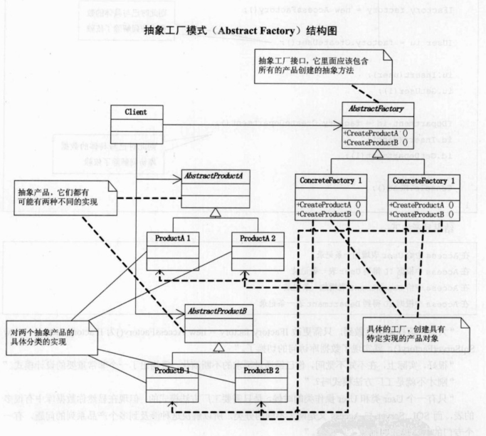

## UML

抽象工厂模式：提供一个创建一系列相关或相互依赖对象的接口，而无需指定它们具体的类。

AbstractProductA和AbstractProductB是两个抽象类，都可以由不同的具体类实现。对应于代码中的IUser和IDapartment两个类。当需要增加产品是就只需要通过创建抽象类，然后实现不同的具体类即可。

IFactory是抽象工厂，也都可以由不同的具体类实现，对应于代码中的SqlSeverFactory和AccessFactory类，相当于不同品牌。当需要增加品牌是可以实现不同的类。当产品增加时，需要在抽象类和具体类中增加创建产品方法。

## Note

同工厂方法比较：

工厂方法模式只有一个工厂，意思就是只生产一种品牌的多种产品。而抽象工厂模型，可以针对不同的品牌生产多种产品。