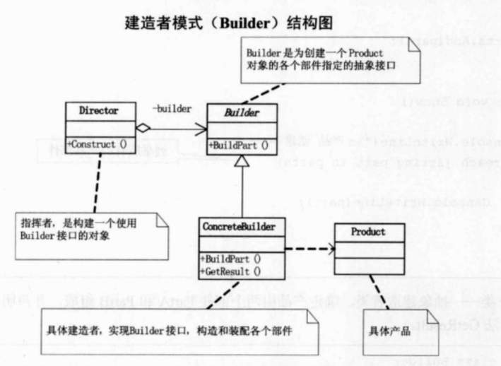

## UML

建造者模式：将一个复杂对象的构建与它的表示分离，使得同样的构建过程可以创建不同的表示。

Builder: 一个建造抽象类，定义了构造的每个部分即规定每个产品制造必须经过的工作流程或组装结构；

ConcreteBuilderA: 具体建造者A，继承Builder，实现各部分自己的建造方法；

ConcreteBuilderB: 具体建造者B，继承Builder，实现各部分自己的建造方法；

Product: 具体产品类，即每个构建者类最后的构建出的结果。

Director: 指挥者，用来根据需求进行构建对象

## Note

构建者模式的好处就是，使得建造代码与表示代码分离，由于建造者隐藏了该产品是如何组装的，所以若需要改变一个产品的内部表示，只需要定义一个具体的建造者就可以了。