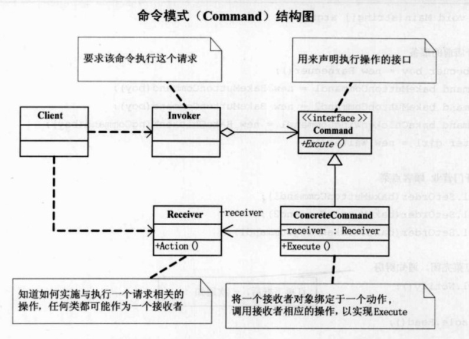

## UML

命令模式：将一个请求封装为一个对象，从而使你可以用不同的请求对客户进行参数化；对请求排队或记录请求日志，以及支持可撤销的操作。

Command类，用来声明执行操作的接口。

ConcreteCommand类，将一个接收者对象绑定与一个动作，调用接收者相应的操作，以实现Execute。

Invoker类，要求该命令执行这个请求。

Receiver类，知道如何实施与执行一个与请求相关的操作，任何类都可能作为一个接收者。