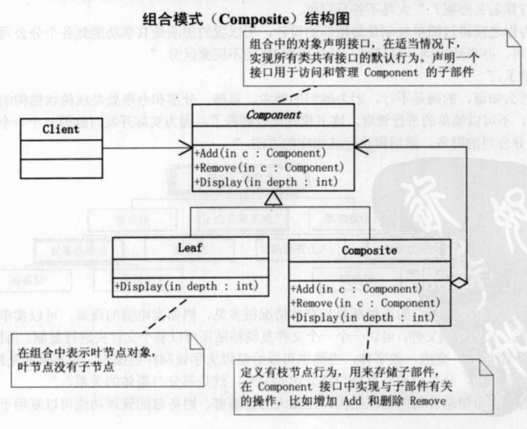

## UML

组合模式：将对象组合成树形结构以表示‘部分-整体’的层次结构。组合模式使得用户对单个对象和组合对象的使用具有一致性。

Component为组合中对象声明接口，在适当情况下，实现所有类共有接口的默认行为。

Leaf在组合中表示叶节点对象，叶节点没有子节点。

Composite定义有枝节点行为，用来存储子部件，在Component接口中实现与子部件有关的操作，比如增加Add和删除Remove。

## Note

