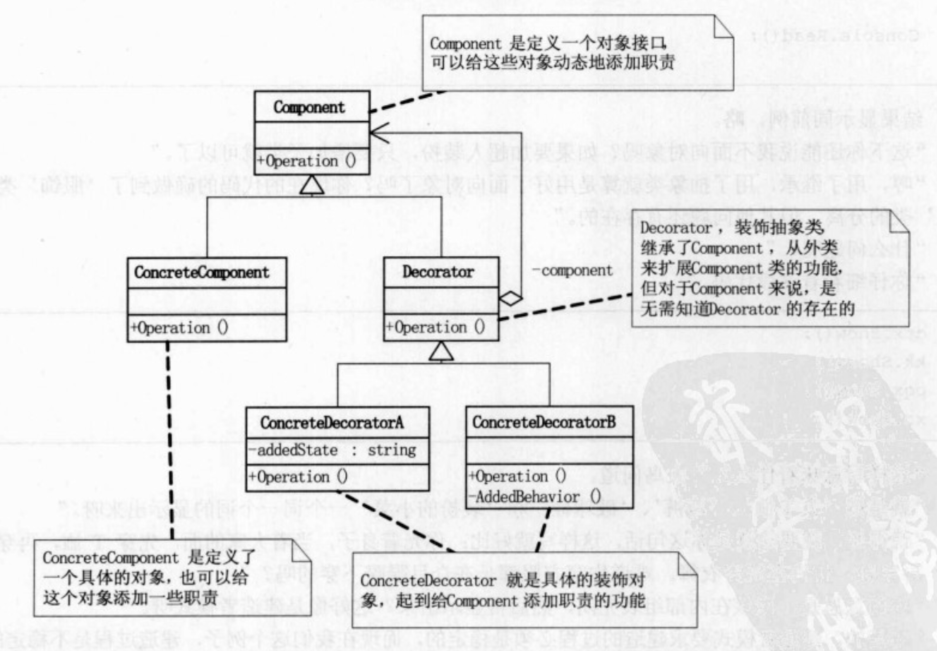

## 情景

穿衣问题：搭配嘻哈服或白领装。上衣+裤子+鞋子

拓展：

* 超人装
* 服饰组合打扮

## Decorator Pattern

动态地给一个对象添加一些额外的职责，就增加功能来说，装饰模式比生成子类更为灵活。

ConcreteComponent 类和Decorator类都继承了抽象类Component，不同的是两个类对operation方法的不同重载。在Decorator类中添加类型为Component的component属性和setComponent方法，通过setComponent方法来初始化component。在Decorator子类中，operation方法首先调用父类的operation方法。

这样就可以通过setComponent来对对象进行包装，每个装饰对象的实现就和如何使用这个对象分离开了，每个装饰对象只关心自己的功能，不需要关心如何被添加到对象链当中。

## Note

装饰模式是为已有功能动态得添加更多功能得一种方式。当系统需要新功能的时候，装饰模式提供一种非常好的解决方案，它把每个要装饰的功能放在单独的类中，并让这个类包装它所需要装饰的对象，因此，当需要执行特殊行为时，客户代码就可以再运行时根据需要有选择地、按顺序地使用装饰功能包装对象。

