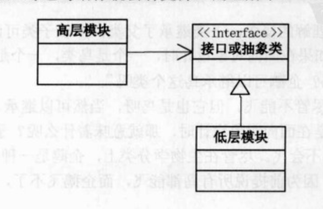

## 1. Single Responsibility Principle

就一个类而言，应该仅有一个引起它变化的原因（There should never be more than one reason for a class to change）[^1]。如果一个类承担的职责过多，就等于把这些职责耦合在一起，一个职责的变化可能会削弱或者抑制这个类完成其他职责的能力。**遵循这一原则最关键的地方在于职责的划分。**

### 情景

俄罗斯方块游戏：

- 界面
- 时间控件
- 擦拭和绘制图形
- 上下左右键各自功能，左右判断碰撞，向下判断堆积和消层

拓展： 

* 迁移到不同平台——界面改变

对于以上情景，可以将界面，游戏逻辑分离出来。

## 2. Open Closed Principle

软件实体应当对扩展开放，对修改关闭（Software entities should be open for extension，but closed for modification）[^2]。软件实体包括：项目中划分出的模块，类与接口，方法。

在最初编写代码时，假设变化不会发生。当变化发生时，创建抽象来隔离以后发生的同类变化。比如Simple Factory Pattern中，最开始实现OperationAdd类，当增加OperationSub类是就先抽象出Operation类作为两个类的父类，之后的同类修改只需要对Operation类进行扩展，而不需要对类进行修改。

## 3. Liskov Substitution Principle

继承必须确保超类所拥有的性质在子类中仍然成立（Inheritance should ensure that any property proved about supertype objects also holds for subtype objects）[^3]。即：一个软件实体如果使用的是一个父类的话，那么一定适用于其子类，而且它察觉不出父类对象和子类对象的区别。也就是说，在软件里面，把父类都替换成它的子类，程序的行为没有变化。即：**子类型必须能够替换掉它们的父类型**。

正是由于子类型的可替换性，才使得使用父类类型的模块在无需修改的情况下就可以拓展。

## 4. Dependence Inversion Principle

高层模块不应该依赖低层模块，两者都应该依赖其抽象；抽象不应该依赖细节，细节应该依赖抽象（High level modules should not depend upon low level modules. Both should depend upon abstractions. Abstractions should not depend upon details. Details should depend upon abstractions）[^4]。

核心思想：**要面向接口编程，不要面向实现编程**

为什么叫倒转？

> 面向过程开发时，为了使得常用代码可以服用，一般都会把这些常用代码写成许许多多函数的程序库，这样我们在做新项目时，去调用这些低层的函数就可以了。比如我们做的项目大多要访问数据库，所以我们就好访问数据库的代码写成函数，每次做新项目时就去调用这些函数。这也就叫做高层模块依赖低层模块。
>
> 问题也就出在这里，我们要做新项目时，发现业务逻辑的高层模块都是一样的，但客户却希望使用不同的数据库或存储信息方式，这是就出现麻烦了。我们希望能再次利用这些高层模块，但高层模块都是与低层的访问数据库绑定在一起的，没办法复用这些高层模块。

高层模块和低层模块都依赖了抽象的接口或抽象类，就不怕更改了。根据Liskov Substitution Principle 可知，由于低层模块是继承了抽象接口或抽象类，所以高层模块可以直接调用低层模块，同时又不依赖低层模块。换而言之，约定好接口，则大家可以灵活自如的组织搭配。

## 5. Interface Segregation Principle

客户端不应该被迫依赖于它不使用的方法（Clients should not be forced to depend on methods they do not use）。该原则还有另外一个定义：一个类对另一个类的依赖应该建立在最小的接口上（The dependency of one class to another one should depend on the smallest possible interface）。[^5]

换言之，要为各个类建立它们需要的专用接口，而不要试图建立一个很庞大的接口供所有依赖它的类去调用。

接口隔离原则和单一职责都是为了提高类的内聚性、降低它们之间的耦合性，体现了封装的思想，但两者是不同的：

- 单一职责原则注重的是职责，而接口隔离原则注重的是对接口依赖的隔离。

- 单一职责原则主要是约束类，它针对的是程序中的实现和细节；接口隔离原则主要约束接口，主要针对抽象和程序整体框架的构建。

## 6. Low of Demeter/Least Knowledge Principle

迪米特法则的定义是：只与你的直接朋友交谈，不跟“陌生人”说话（Talk only to your immediate friends and not to strangers）[^6]。其含义是：如果两个软件实体无须直接通信，那么就不应当发生直接的相互调用，可以通过第三方转发该调用。其目的是降低类之间的耦合度，提高模块的相对独立性。

迪米特法则中的“朋友”是指：当前对象本身、当前对象的成员对象、当前对象所创建的对象、当前对象的方法参数等，这些对象同当前对象存在关联、聚合或组合关系，可以直接访问这些对象的方法。

迪米特法则首先强调的前提是在类的结构设计上，每一个类都应当尽量降低成员的访问权限，也就是说，一个类包装好自己的private状态，不需要让别的类知道的字段或行为就不要公开。

## 7. Composition/Aggregate Reuse Principle

要求在软件复用时，要尽量先使用组合或者聚合等关联关系来实现，其次才考虑使用继承关系来实现[^7]。

通常类的复用分为继承复用和合成复用两种，继承复用虽然有简单和易实现的优点，但它也存在以下缺点。

1. 继承复用破坏了类的封装性。因为继承会将父类的实现细节暴露给子类，父类对子类是透明的，所以这种复用又称为**“白箱”**复用。
2. 子类与父类的耦合度高。父类的实现的任何改变都会导致子类的实现发生变化，这不利于类的扩展与维护。
3. 它限制了复用的灵活性。从父类继承而来的实现是静态的，在编译时已经定义，所以在运行时不可能发生变化。

采用组合或聚合复用时，可以将已有对象纳入新对象中，使之成为新对象的一部分，新对象可以调用已有对象的功能，它有以下优点。

1. 它维持了类的封装性。因为成分对象的内部细节是新对象看不见的，所以这种复用又称为**“黑箱”**复用。
2. 新旧类之间的耦合度低。这种复用所需的依赖较少，新对象存取成分对象的唯一方法是通过成分对象的接口。
3. 复用的灵活性高。这种复用可以在运行时动态进行，新对象可以动态地引用与成分对象类型相同的对象。

## References

[^1]: [面向对象设计原则：单一责任原则](http://c.biancheng.net/view/1327.html)
[^2]: [面向对象设计原则：开闭原则](http://c.biancheng.net/view/1322.html)
[^3]: [面向对象设计原则：里氏替换原则](http://c.biancheng.net/view/1324.html)
[^4]: [面向对象设计原则：依赖倒置原则](http://c.biancheng.net/view/1326.html)
[^5]: [面向对象设计原则：接口隔离原则](http://c.biancheng.net/view/1330.html)
[^6]: [面向对象设计原则：迪米特法则/最少知识原则](http://c.biancheng.net/view/1331.html)
[^7]: [面向对象设计原则：组合/聚合复用原则](http://c.biancheng.net/view/1333.html)