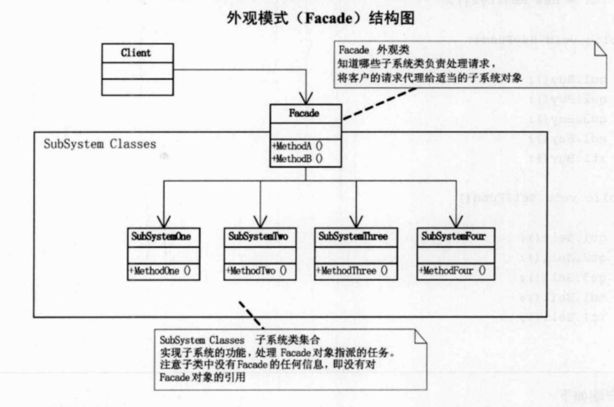

## UML

外观模式：为子系统中的一组接口提供一个一致的界面，此模式定义了高层接口，这个接口是的这一子系统更加容易使用。

何时使用外观模式：

首先，在设计初期阶段，应该要有意识的将不同的两个层分离，比如经典的三层架构，就需要考虑在数据访问层和业务逻辑层、业务逻辑层和表示层的层与层之间建立外观Facade。这样就可以为复杂的子系统提供一个简单的接口，使得耦合大大降低。

其次，在开发阶段，子系统往往因为不断的重构演化而变得越来越复杂，大多数的模式使用时也都会产生很多较小的类，这本是耗时，但也给外部调用它们的用户程序带来了使用上的困难，增加Facade可以提供一个简单的接口，减少它们之间的依赖。

第三，在维护一个遗留的大型系统是，可能这个系统已经非常难以维护和扩展了，但因为它包含非常重要的功能，新的需求开发必须依赖于它。此时用Facade也是非常合适的。可以为新系统开发一个Facade类来提供设计粗糙或高度复杂的遗留代码的比较清晰简单的接口，让新系统与Facade对象交互，Facade与遗留代码交互所有复杂的工作。

## Note

Facade集合处理其他子类，客户端通过调用Facade来使用其他复杂的类。