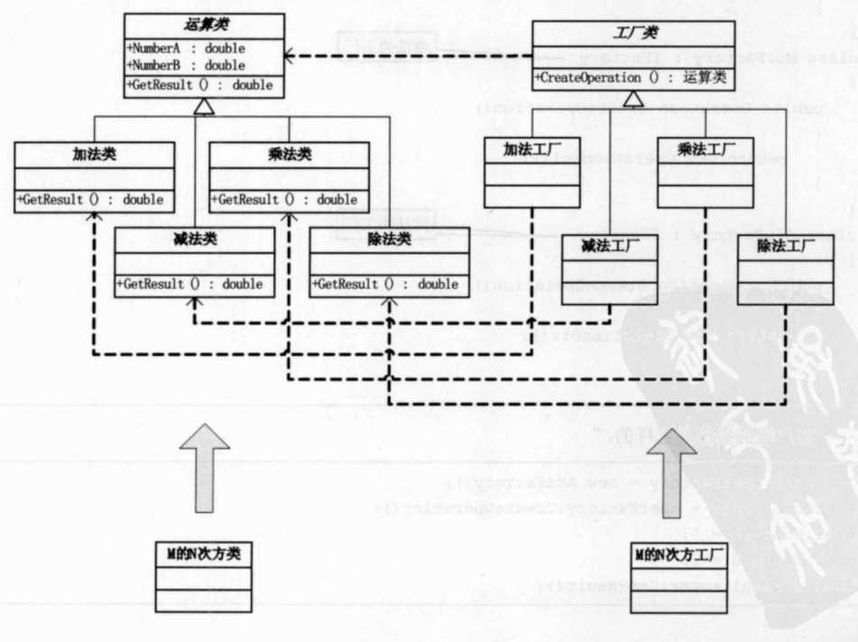
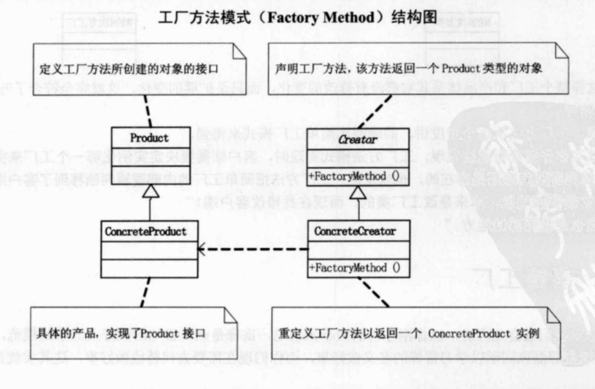

## UML

工厂模式：定义一个用于创建对象的接口，让子类决定实例化哪一个类。工厂方法使用一个类的实例化延迟到其子类。

工厂模式的计算器：

工厂模式的结构图：

## Note

简单工厂模式的最大优点在于工厂类中包含了必要的逻辑判断，根据客户端的选择条件动态实例化相关的类。也就是说，只需要把你选择好的结果给工厂，工厂自动就给出了相应的实例，客户端就可以直接执行相关操作。但如果需要添加功能时，就一定要给运算工厂类方法里添加case分支，这违背了Open Closed Principle。

工厂模式中，客户端需要决定实例化哪个工厂来实现运算类，选择判断的问题还是存在的，也就是说，相对于简单工厂模式，工厂模式把内部逻辑判断已到了客户端代码中。当需要增加功能时，本来是改工厂类的，而现在时修改客户端。