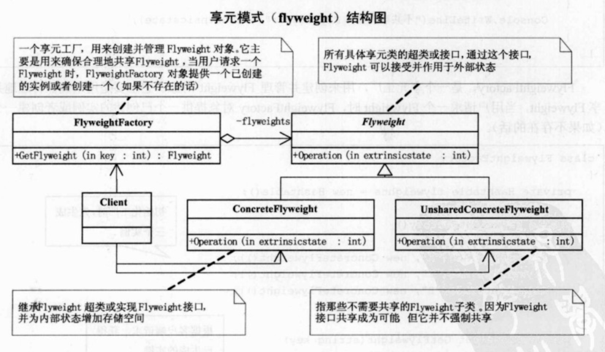

## UML

享元模式：运用共享技术有效地支持大量细粒度地对象。

Flyweight类，它是所有具体享元类地超类或接口，通过这个接口，Flyweight可以接受并作用域外部状态。

ConcreteFlyweight是继承Flyweight超类或实现Flyweight接口，并为内部状态增加存储空间。

UnsharedConcreteFlyweight是指那些不需要共享的Flyweight子类。

FlyweightFactory是一个享元工厂，用来创建并管理Flyweight对象。只要是用来确保合理地共享Flyweight，当用户请求一个Flyweight时，FlyweightFactory对象提供一个已创建地实例或者创建一个。