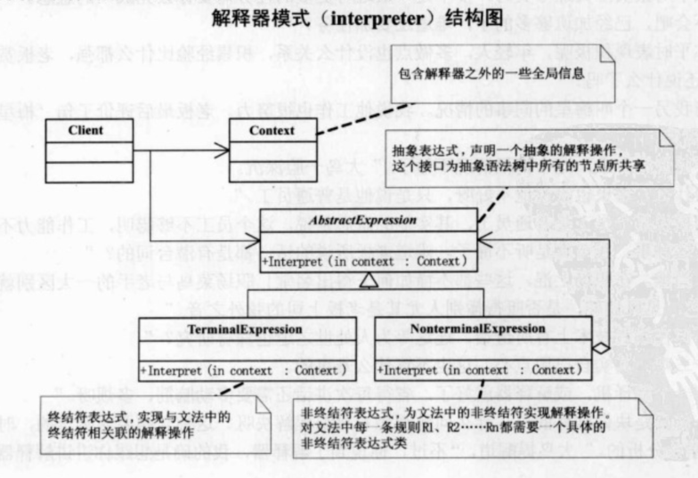

## UML

解释器模式：给定一个语言，定义它的文法的一种表示，并定义一个解释器，这个解释器使用该表示来解释语言中的句子。

AbstractExpress（抽象表达式）声明一个抽象的解释操作，这个接口为抽象语法树中所有的节点所共享。

TerminalExpress（终结符表达式）实现与文法中的终结符相关联的解释操作。实现抽象表达式中所要求的接口，主要是一个interpret方法。文法中每一个终结符都有一个具体中介表达式与之相对应。

NonterminalExpression（非终结符表达式），为文法中的非终结符实现解释操作。对文法中每一条规则R1，R2，...，Rn都需要一个具体的非终结符表示式类。通过实现抽象表达式的interpret方法实现解释操作。解释操作以递归方式调用上面所提到的代表R1，R2，...，Rn中各个符号的实例变量。

Context，包含解释器之外的一些全局信息。