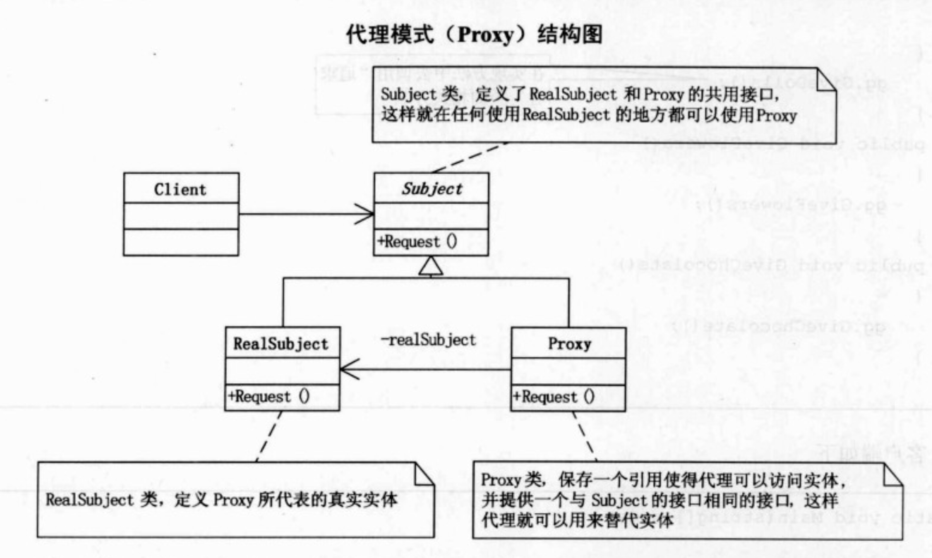

## UML

代理模式：为其他对象提供一种代理以控制对这个对象得访问。

Subject类定义了RealSubject和Proxy的共用接口，这样就在任何使用RealSubject的地方都可以使用Proxy。只需要在Proxy中定义RealSubject对象，然后通过该对象来重载父类方法。

## Note

为什么需要代理者：

>  由于某些原因需要给某对象提供一个代理以控制对该对象的访问。这时，访问对象不适合或者不能直接引用目标对象，代理对象作为访问对象和目标对象之间的中介。

代理模式运用场合：

> 第一，远程代理，也就是为一个对象在不同的地址空间提供局部代表。这样可以隐藏一个对象存在于不同地址空间的事实。
>
> 第二，虚拟代理，是根据需要创建开销很大的对象。通过它来存放实例化需要很长时间的真实对象。
>
> 第三，安全代理，用来控制真实对象访问时的权限。
>
> 第四，智能指引，是指当调用真实的对象时，代理处理另外一些事。