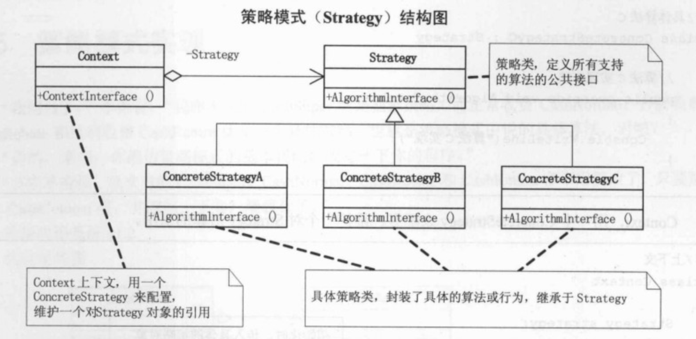

## 情景

做一个商场收银软件，营业员根据客户所购买商品的单价和数量，向客户收费。

拓展方向：

* 商场活动，打折销售；多种折扣
* 满减；多种满减
* 积分返利

简单工厂模式虽然也能解决这个问题，但这个模式知识解决对象的创建问题，而且由于工厂本身包括了所有的收费方式，商场是可能经常性地更改打折额度和返利额度，每次维护或拓展收费方式都要改动这个工厂，以致代码需要重新编译部署，所以用它不是最好的办法。**面对算法的时常改动，应该有更好的方法。**

## Strategy Pattern

定义算法家族，分别封装起来，让它们之间可以互相替换，此模式让算法的变化不会影响到使用算法的客户。

Content 类和Strategy 类是**聚合(Aggregation)**[^1]关系，聚合表示一种弱的“拥有”关系，体现的是Content对象可以包含Strategy对象，但是Content对象不是Strategy对象的一部分，且Strategy对象脱离Content具有独立意义。Content对象和Strategy对象之间是**Has-A**关系

每个Content对象可以有多个Strategy对象组成。

## Note

### 与Simple Factory Pattern对比

SimpleFactory 类根据运算符来初始化对应的运算类，返回**一个**Operation对象。而Content类根据不同ConcreteStrategy对象来构造不同的content对象，可以组合**多个**不同的ConcreteStrategy对象。

----

## 参考文献

[^1]: [Java 聚合](https://geek-docs.com/java/java-tutorial/java-aggregation.html)

