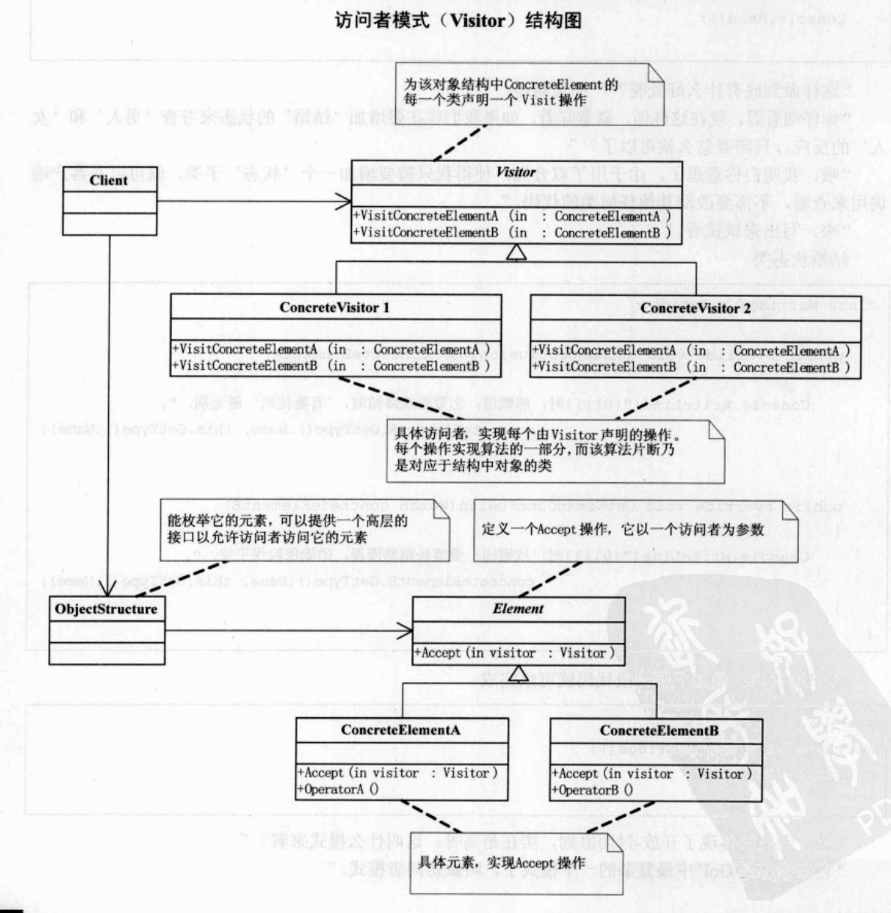

##  UML

访问者模式：表示一个作用于某对象结构中的各元素的操作。它使你可以再不改变各元素的类的前提下定义作用于这些 元素的新操作。

Visitor类，为对象结构中ConcreteElement的每一个类声明一个Visit操作。

ConcreteVisitorA/B类，具体访问者，实现每个由Visitor声明的操作。每个操作实现算法的一部分，而该算法片段乃是对应于结构中对象的类。

Element类，定义一个accept方法，它以一个访问者为参数。

ConcreteElementA/B类，具体元素，实现accept操作。

ObjectStructure类，枚举元素，可以提供一个高层的接口以允许访问者访问它的元素。